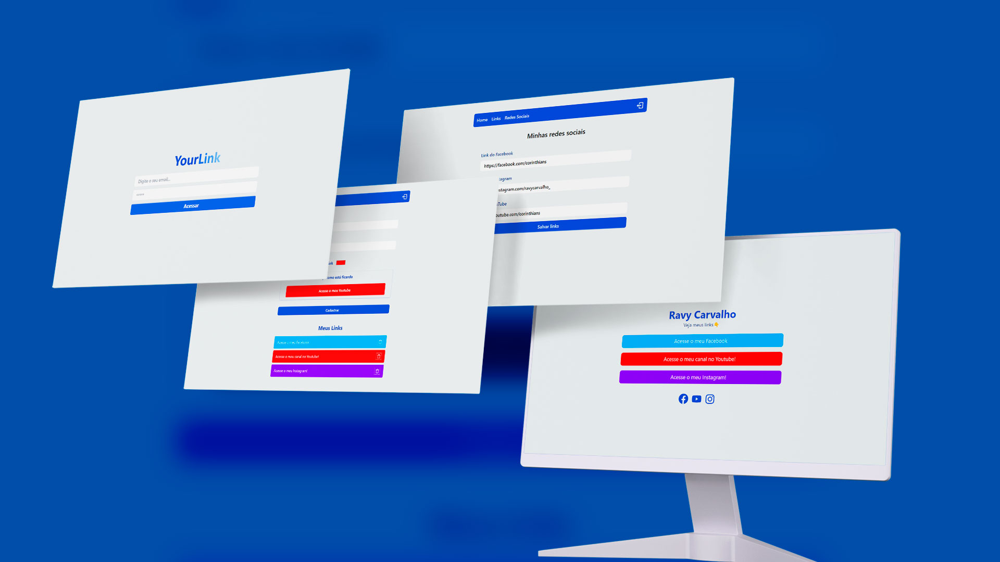

<h1 align="center"> YourLink - Linktree</h1>

  <a href="#-tecnologias">Tecnologias</a>&nbsp;&nbsp;&nbsp;|&nbsp;&nbsp;&nbsp;
  <a href="#-projeto">Projeto</a>&nbsp;&nbsp;&nbsp;|&nbsp;&nbsp;&nbsp;
  <a href="#-layout">Layout</a>&nbsp;&nbsp;&nbsp;|&nbsp;&nbsp;&nbsp;
  <a href="#memo-licença">Licença</a>

  

 

  

## 🚀 Tecnologias

Esse projeto foi desenvolvido com as seguintes tecnologias:

- React JS
- TypeScript
- Firebase
- Tailwind
- Axios
- Git e Github

## 💻 Projeto

O projeto é uma aplicação desenvolvida em TypeScript utilizando React e com uma interface construída com Tailwind CSS. Inspirado no conceito do Linktree, ele oferece uma solução para centralizar e organizar links para diferentes plataformas de divulgação.

Os principais recursos incluem:

### Cadastro de Links: 
Os usuários podem cadastrar os links de suas redes sociais, sites pessoais, portfólio, entre outros, em uma interface amigável e intuitiva. (Mas no caso desse projeto, só admin poderá criar, no caso o desenvolvedor). 

### Personalização:
É possível personalizar a aparência da página de links com diferentes temas e estilos disponíveis.

### Gerenciamento de Links:
Os usuários podem editar, adicionar ou remover links conforme necessário, proporcionando flexibilidade na gestão dos seus conteúdos.

### Divulgação Simplificada: 
A aplicação fornece um link único que redireciona para a página de links personalizada do usuário, facilitando a divulgação em redes sociais, assinaturas de e-mail, etc.

### Responsividade: 
A interface é responsiva, adaptando-se a diferentes dispositivos e tamanhos de tela.

No geral, o projeto proporciona uma maneira eficiente e elegante de consolidar e compartilhar os diversos links de um usuário, simplificando o processo de divulgação online.

- [Acesse o projeto finalizado, online](https://your-link.vercel.app/)

## 🔖 Layout

Layout desenvolvido por Ravy Carvalho.

YourLink.

